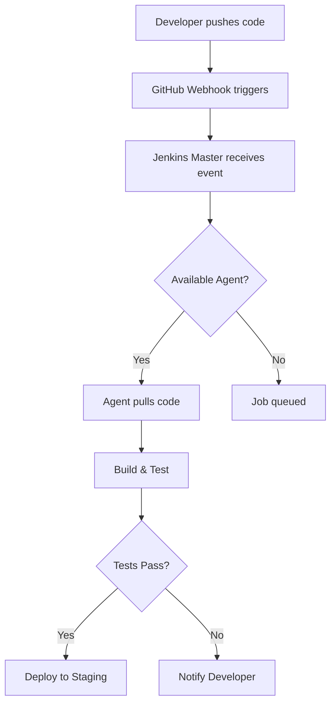

# 🤝 Contributing to DevopsNotes

> **This is not a Wikipedia mirror. This is a field manual.**
> Every note added here should feel like a senior engineer explaining something on a whiteboard — not a documentation page you already Googled.

---

## 📖 Table of Contents

- [Philosophy](#-philosophy)
- [What Belongs Here](#-what-belongs-here)
- [Folder & File Structure](#-folder--file-structure)
- [The Anatomy of a Great Note](#-the-anatomy-of-a-great-note)
- [Writing Style Guide](#-writing-style-guide)
- [Diagrams — The Core of Every Topic](#-diagrams--the-core-of-every-topic)
- [Prerequisites Section — Non-Negotiable](#-prerequisites-section--non-negotiable)
- [Code Blocks — How to Do Them Right](#-code-blocks--how-to-do-them-right)
- [Worked Examples & Walkthroughs](#-worked-examples--walkthroughs)
- [Common Anti-Patterns to Avoid](#-common-anti-patterns-to-avoid)
- [Full Note Template](#-full-note-template)
- [Submitting a PR](#-submitting-a-pr)

---

## 🧭 Philosophy

The notes in this repo exist because **documentation alone doesn't build intuition**. A contributor should think about the reader as someone who has read the official docs and is now confused about *why it works the way it does*.

Before writing a single word, ask yourself three questions:

1. **What problem does this tool/concept solve, and what was the world like before it?**
2. **What is the mental model someone needs to hold in their head while using this?**
3. **Where does this typically break, and why?**

If you can answer these three questions deeply, you are ready to write the note.

---

## ✅ What Belongs Here

| ✅ Add This | ❌ Skip This |
|---|---|
| Conceptual deep-dives with diagrams | Copy-paste from official docs |
| Real-world "why" behind commands | Command reference tables without context |
| Architecture flows (how data moves) | One-liner definitions |
| Troubleshooting patterns you've hit | Generic "getting started" fluff |
| Comparisons with related tools | Uncontextualized YAML snippets |
| Prerequisites and mental models | Half-finished notes |

---

## 📁 Folder & File Structure

Each tool or concept gets its **own folder** at the repo root, named in `SCREAMING_SNAKE_CASE` like the existing ones:

```
DevopsNotes/
├── JENKINS/
│   ├── README.md          ← main notes file (required)
│   ├── images/            ← all diagrams/screenshots referenced in notes
│   │   └── jenkins-architecture.png
│   └── examples/          ← optional: config files, Jenkinsfiles, etc.
│       └── Jenkinsfile.example
├── DOCKER/
├── KUBERNETES/
...
```

**Rules:**
- The `README.md` inside the folder is the primary note file. All readers land here first.
- Store images locally in an `images/` subfolder — do not hotlink external images (they rot).
- If you have multi-part notes (e.g., Jenkins Basics + Jenkins Pipelines + Jenkins + K8s), use clearly named separate `.md` files alongside the main `README.md`.

---

## 🦴 The Anatomy of a Great Note

Every note file must have these sections **in this order**. Don't skip any — even if a section is short, write it.

```
1. Header (Tool name, one-sentence hook)
2. The Problem It Solves (the "why" — before this tool existed, what was painful?)
3. Core Mental Model (the single diagram/concept that explains everything)
4. Prerequisites
5. Architecture / How It Works Internally
6. Installation & Setup
7. Core Concepts (with sub-diagrams)
8. Hands-On Walkthrough (step by step, with expected outputs)
9. Common Patterns / Real-World Usage
10. Gotchas & Troubleshooting
11. How It Connects to Other Tools in the Stack
12. Quick Reference (cheat sheet at the end)
```

---

## ✍️ Writing Style Guide

### Voice

Write like you're pairing with someone, not lecturing them. Use "we", "you", "let's". Short punchy sentences when introducing a new idea. Longer when explaining consequence or mechanism.

**Bad:**
> Jenkins is an open-source automation server which enables developers to build, test, and deploy their software.

**Good:**
> Before Jenkins, someone on your team was the "deploy person." They'd SSH into a server, pull the latest code, pray nothing was different from last time, and run the deploy script manually. Jenkins automates that entire ceremony — and more importantly, it makes it *repeatable and auditable*.

### Explain Consequences, Not Just Commands

Don't write: `kubectl apply -f deployment.yaml`

Write:
> Running `kubectl apply -f deployment.yaml` doesn't just "create" your pod — it submits a *desired state* to the API server. The control plane's reconciliation loop will then read the current state of the cluster, diff it against your desired state, and take the minimum set of actions needed to close that gap. This is why you can re-run `apply` safely; it's idempotent.

### Use Analogies for Abstract Concepts

If a concept has no good real-world parallel, find one. Examples from existing notes in the repo:

- Docker containers ≈ shipping containers (standardized, portable, stackable)
- Kubernetes Pods ≈ the smallest deployable unit, like a single process wrapper
- Terraform state ≈ a snapshot of what Terraform *thinks* the world looks like right now

Keep analogies tight — one sentence, then move on.

---

## 📊 Diagrams — The Core of Every Topic

**Every major concept needs a diagram.** Not decorative — *explanatory*.

### Use Mermaid for architecture/flow diagrams

Mermaid renders natively in GitHub. Prefer it over external image tools for flow diagrams.

````markdown

````

### Use ASCII diagrams for simple spatial layouts

For things like network topologies or component relationships where Mermaid feels heavy:

```
  ┌─────────────────────────────────────┐
  │            Jenkins Master            │
  │  ┌──────────┐    ┌──────────────┐   │
  │  │ Build Q  │    │  Plugin Mgr  │   │
  │  └──────────┘    └──────────────┘   │
  └────────────┬────────────────────────┘
               │ (SSH / JNLP)
       ┌───────┴───────┐
       │               │
  ┌────▼───┐     ┌─────▼──┐
  │ Agent1 │     │ Agent2 │
  │(Linux) │     │(Docker)│
  └────────┘     └────────┘
```

### When to use a screenshot

Screenshots are appropriate for:
- UI-based tools where configuration isn't expressed as code (e.g., Jenkins plugin manager view)
- Showing expected output in a terminal after running a command

Always annotate screenshots with arrows or callouts if something specific needs pointing out. Store them in `images/` folder.

### Diagram checklist

Before moving on from any architecture diagram, verify it answers:
- [ ] What initiates the flow?
- [ ] What are the components and what role does each play?
- [ ] What is the data/artifact moving through the system?
- [ ] Where can this fail?

---

## 🔧 Prerequisites Section — Non-Negotiable

This section prevents the most common contributor failure: assuming too much.

**Format it exactly like this:**

```markdown
## Prerequisites

Before diving in, make sure you're comfortable with:

- **Linux command line** — you'll be running most of this on a terminal; comfort with `ssh`, file permissions, and process management is assumed
- **Basic networking** — ports, protocols (TCP/UDP), and what a reverse proxy does
- **Docker basics** — Jenkins agents often run inside containers; understand images, containers, and `docker run`

If you haven't touched Docker yet, go through the [DOCKER notes](../DOCKER/README.md) first.

**Tools you'll need installed:**
| Tool | Version | Why |
|------|---------|-----|
| Java (JDK) | 11+ | Jenkins runs on JVM |
| Docker | 20.x+ | For containerized agents |
| Git | Any recent | Source control integration |
```

The key things to always include:
1. **Conceptual prerequisites** — what knowledge the reader must already have
2. **Cross-links** — point to other notes in *this repo* if a prerequisite is covered here
3. **Tool versions** — always include; version mismatches are a silent killer

---

## 💻 Code Blocks — How to Do Them Right

### Always specify the language

````markdown
```bash          ← shell commands
```yaml          ← config files
```groovy        ← Jenkinsfiles
```hcl           ← Terraform
```python        ← scripts
```dockerfile    ← Dockerfiles
```
````

### Show expected output

After commands that produce visible output, include the output as a separate block with a comment:

```bash
# Check Jenkins service status
systemctl status jenkins
```

```
● jenkins.service - Jenkins Continuous Integration Server
     Loaded: loaded (/lib/systemd/system/jenkins.service; enabled)
     Active: active (running) since Mon 2024-01-15 10:23:45 UTC; 2h 14min ago
```

### Annotate non-obvious flags

Don't just dump a command. If any flag is non-trivial, explain it inline:

```bash
docker run -d \                    # detached mode (runs in background)
  -p 8080:8080 \                   # host:container port mapping
  -p 50000:50000 \                 # agent communication port (JNLP)
  -v jenkins_home:/var/jenkins_home \   # persist config between restarts
  --restart=on-failure \           # auto-restart if container crashes
  jenkins/jenkins:lts-jdk17
```

### For YAML/config files, always include comments explaining non-obvious fields

```yaml
pipeline {
  agent {
    docker {
      image 'maven:3.9-eclipse-temurin-17'  # Use a specific version, never :latest in CI
      args '-v $HOME/.m2:/root/.m2'          # Cache Maven deps outside the container
    }
  }
  stages {
    stage('Build') {
      steps {
        sh 'mvn -B -DskipTests clean package'  # -B = batch mode (no interactive prompts)
      }
    }
  }
}
```

---

## 🔬 Worked Examples & Walkthroughs

Walkthroughs are the most valuable part of any note. They are what separates this repo from a documentation mirror.

### Structure of a good walkthrough

1. **Set the scene** — what are we building/doing and why?
2. **List what we'll create** — files, configurations, expected outcomes
3. **Step by step** — numbered steps with commands AND explanations
4. **Show the output** — what the reader should see at each stage
5. **Explain what just happened** — a short paragraph after the walkthrough tying it together

**Example structure:**

```markdown
### 🛠️ Walkthrough: Setting Up a Jenkins Pipeline for a Node.js App

**Goal:** Automate testing and Docker image building for a Node.js app on every push to `main`.

**What we'll create:**
- A `Jenkinsfile` in the project root
- A parameterized pipeline with 3 stages: Install → Test → Build Image

**Step 1: Install the NodeJS Plugin**

Go to `Dashboard → Manage Jenkins → Plugins → Available` and install `NodeJS Plugin`.
This plugin lets Jenkins manage Node.js versions instead of relying on whatever's installed on the agent.

**Step 2: Configure a Node.js installation**

Navigate to `Dashboard → Manage Jenkins → Tools → NodeJS installations`.
Add a new installation named `node-18` pointing to Node.js 18.x. Jenkins will auto-install it on first use.

**Step 3: Create the Jenkinsfile**

In your project root, create `Jenkinsfile`:

(... code block ...)

**What just happened?**
Jenkins pulled your code, used the NodeJS plugin to set up the correct Node version in the agent's PATH,
ran your tests in isolation, and if they passed, built a Docker image tagged with the git commit SHA.
Every run is traceable back to a specific commit.
```

---

## 🚫 Common Anti-Patterns to Avoid

These are the things that make notes useless. **Do not do these.**

### 1. Definition-dumping without context

❌ **Bad:**
> A Jenkins agent is a machine that is set up to offload build projects from the main Jenkins instance.

✅ **Good:**
> The Jenkins master never actually *runs* your builds — it just schedules and orchestrates them. The agent is where the work happens. This separation exists for a reason: your master holds all your config, history, and secrets. You don't want a runaway build process with access to all of that. Agents are isolated, disposable, and can run on different OS/hardware than your master.

### 2. Commands without explaining when/why

❌ **Bad:**
> `kubectl rollout restart deployment/my-app`

✅ **Good:**
> If you've updated a secret or ConfigMap that your deployment references, Kubernetes won't automatically restart your pods — it doesn't watch those resources for changes. Use `kubectl rollout restart deployment/my-app` to trigger a rolling restart without changing the deployment spec itself.

### 3. Notes that end abruptly with no "so what"

Always close a major section with a sentence that connects what was just explained to the broader system. "Now that Jenkins is building your image, the next natural question is where it goes — which is where your container registry and Kubernetes deployment pipeline come in."

### 4. Screenshots without context

A screenshot of a UI with no annotation is dead weight. If you use a screenshot, put a caption or inline text explaining *exactly what to look at* in the image.

### 5. Skipping the failure modes

Every tool has predictable failure modes. If you've gotten a tool working, you've almost certainly hit at least one of them. Document it:

```markdown
### Common Issues

**"No valid crumb was included in the request"**
This is Jenkins' CSRF protection triggering. Happens when you try to trigger a build via a webhook
without the correct crumb header. Fix: In older Jenkins versions, go to `Manage Jenkins → Security`
and enable "Enable proxy compatibility" if you're behind a reverse proxy like Nginx.

**Agent won't connect — port 50000 refused**
The JNLP agent port. If your agent is on a different machine/network, make sure port 50000 is open
on the Jenkins master's firewall. This is separate from the UI port (8080).
```

---

## 📄 Full Note Template

Copy this template when starting a new note. Delete sections that genuinely don't apply (rare), but don't skip them just because they're hard to write.

```markdown
# <Tool Name>

> One-sentence hook: what this tool does and why it matters in the DevOps stack.

---

## The Problem It Solves

*Before <tool> existed, teams had to...*

Explain the pain that existed before. Make it concrete — describe what a human had to do manually,
what went wrong, why it was slow/fragile/risky. 2–4 paragraphs.

---

## Core Mental Model

*The single diagram/concept you must hold in your head while using this tool.*

(Mermaid diagram or ASCII art here)

Brief explanation of what the diagram shows — 3–5 sentences max.

---

## Prerequisites

Before diving in, make sure you're comfortable with:

- **Concept 1** — why it matters here
- **Concept 2** — why it matters here

Cross-links to other notes in this repo if applicable.

**Tools you'll need installed:**
| Tool | Min Version | Why |
|------|------------|-----|
| ... | ... | ... |

---

## Architecture — How It Works Internally

*What actually happens when you use this tool?*

Walk through the internal components. Use a diagram. Explain what each piece does
and — critically — *why it's designed that way*.

---

## Installation & Setup

```bash
# Step-by-step installation commands
# with inline comments
```

Expected output after installation:

```
...
```

Verification step:
```bash
# How to confirm it's working
```

---

## Core Concepts

### Concept A

Explanation. Why does this exist? What would break without it?

(diagram if helpful)

### Concept B

...

---

## Hands-On Walkthrough

### 🛠️ Walkthrough: [Specific goal]

**Goal:** ...

**Step 1: ...**
...

**Step 2: ...**
...

**What just happened?**
...

---

## Common Patterns

*Real-world configurations you'll actually use.*

### Pattern 1: [Name]

When to use this, then the config/command.

---

## Gotchas & Troubleshooting

**Issue:** [Symptom]
**Cause:** [Why it happens]
**Fix:** [What to do]

---

## How It Connects to the Rest of the Stack

*Where does this tool sit relative to Docker / Kubernetes / CI-CD / Terraform?*

(optional diagram showing integration points)

---

## Quick Reference

| Command / Config | What it does |
|---|---|
| `...` | ... |
```

---

## 🚀 Submitting a PR

1. **Fork the repo** and create a branch named `add/<tool-name>` (e.g., `add/jenkins`)
2. Write your note following this guide
3. Self-review against this checklist before opening the PR:
   - [ ] Does the note have all required sections?
   - [ ] Is there at least one architecture diagram?
   - [ ] Does every code block have a language specifier?
   - [ ] Are prerequisites listed with cross-links to relevant existing notes?
   - [ ] Is there a worked walkthrough, not just commands?
   - [ ] Are common failure modes documented?
   - [ ] Does the note explain *why*, not just *what*?
4. Open a PR with the title `[NEW] <Tool Name> notes` or `[EXPAND] <Tool Name> - <topic added>`
5. In the PR description, mention which existing notes this one relates to or builds on

---

> **"The best engineer on the team isn't the one who knows the most commands. It's the one who can explain *why* those commands work."**
>
> That's the standard for notes in this repo.